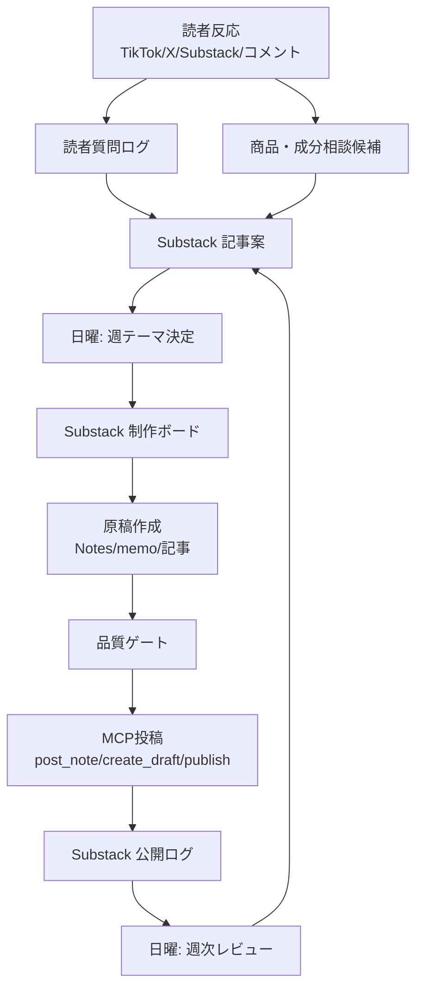

# Substack 運用OS

## 0. このファイルの役割

このファイルを、筋太郎の Substack 運用の入口にする。

迷ったらまずここを見る。

| 知りたいこと | 見る場所 |
|---|---|
| 今週何を投稿するか | [[Substack 制作ボード]] |
| 来週以降の候補 | [[Substack 記事案]] |
| 具体的な投稿ルール | [[Substack 即実行運用プレイブック]] |
| 初週の実原稿 | [[Substack Week1 投稿パッケージ]] |
| 投稿済みURL/post_id/note_id | [[Substack 公開ログ]] |
| 読者から出た質問 | [[読者質問ログ]] |
| 商品/成分候補 | [[商品・成分相談候補]] |
| 週次KPI | [[週次SNSレビュー]] |

## 1. 運用の基本設計

Substackは「長文を置く場所」ではなく、信頼、メールリスト、読者質問、商品・成分の相談候補を蓄積する母艦として運用する。

Substack上の名前は `筋太郎` にする。複数人運営や公式メディアの硬さを出さず、読者が話しかけやすい個人アカウントとして運用する。

プロフィールの軸は「大学院で腸内細菌の研究をしながら、ソフトウェアエンジニアをしている人」。AI活用にも関心があり、フィットネスとヘルスケアをぶち上げて、日本の健康寿命延伸を主導する、という熱量を持つ。

ここでは、BB側の思想を強く押しつけない。健康、栄養、サプリ、体づくりについて「それって自分に必要？」を読者と一緒に考える場所にする。

文章は、解説記事というより体験談、学習ログ、日記に寄せる。自分が迷ったこと、買う前に立ち止まったこと、調べてみて分かったことを起点にする。

温度感は高めにする。真面目な注意書きや医療安全に関わる部分以外は、文末を `。` で締めすぎず、`！` を基本にする。敬語ベースで、読者に話しかける感じにする。`🔥` や `💪` も自然に使ってよい。

対象読者はガチ勢だけではない。健康的にマッチョになりたい人、食事や栄養をちゃんと知りたい人、SNSの健康情報に振り回されがちな人、ジムも食事管理もゆるく続けたい人を歓迎する。

運用は以下の流れで回す。



## 2. テーマはどこで決めるか

テーマは毎週日曜20:00の週次レビューで決める。

最終決定場所は [[Substack 制作ボード]]。

候補の保管場所は [[Substack 記事案]]。

読者起点の素材は以下に分けて入れる。

| 素材 | 入れる場所 |
|---|---|
| 読者の質問、悩み、違和感 | [[読者質問ログ]] |
| 商品名、成分名、カテゴリ | [[商品・成分相談候補]] |
| 記事化したいテーマ案 | [[Substack 記事案]] |
| その週に実際に出すもの | [[Substack 制作ボード]] |

### 2.1 テーマ決定の責任者

| 役割 | 担当 |
|---|---|
| 最終決定 | 侑来 |
| 科学的妥当性確認 | 筋太郎 |
| 表現/安全性確認 | 筋太郎 |
| 原稿作成/投稿実行 | 筋太郎 + Codex |

### 2.2 テーマ採点

毎週、候補テーマを100点満点で採点する。

| 項目 | 点数 | 見ること |
|---|---:|---|
| 読者需要 | 25 | コメント、質問、TikTok/X反応があるか |
| 筋太郎らしさ | 20 | 体験談として自然で、読者が話しかけやすいか |
| 保存性 | 15 | 後から読まれる判断基準になるか |
| 事業接続 | 15 | BB Checker、コミュニティ、案件に接続するか |
| 専門確認のしやすさ | 10 | 自分で確認できる範囲か、外部確認が必要か |
| Substack内の会話性 | 10 | コメント/Restackが起きそうか |
| AI発信者との接点 | 5 | AI活用/開発文脈につながるか |

採点後、原則として最も高いテーマを金曜の保存版記事にする。

ただし、専門確認が重いテーマはmemoか翌週以降に回す。

## 3. 内容はいつ書くか

1週間分の大枠は日曜に決め、原稿は月曜から木曜に分けて作る。

| 曜日 | 時間 | 作業 | 成果物 |
|---|---|---|---|
| 日 | 20:00 | 週次レビュー、次週テーマ決定 | [[Substack 制作ボード]]更新 |
| 毎日 | 7:30 | AI Note 3本を生成、品質ゲート | 8:30/12:30/17:30分の本文 |
| 毎日 | 随時 | 侑来の指示Noteを作成 | 21:00/23:00分の本文 |
| 火 | 10:00 | 金曜記事の下調べ、構成作成 | 記事構成 |
| 水 | 10:00 | memo執筆、必要なら専門確認 | memo原稿 |
| 木 | 10:00 | 金曜保存版記事の本文作成 | 記事原稿 |
| 木 | 18:00 | 記事の品質ゲート、メール配信判定 | 投稿可否決定 |
| 金 | 15:00 | 最終整形、MCP下書き作成 | post_id/edit_url |
| 金 | 21:00 | 保存版記事公開 | public_url |
| 土 | 10:00 | 再投稿Note、コメント返信 | Note/返信 |
| 日 | 20:00 | KPI確認、次週へ反映 | 週次SNSレビュー |

## 4. Notesと記事の分け方

Substackでは `Notes` と `記事` を明確に分ける。日本のnote.comとは別物として扱う。

| 種別 | 役割 | 文字数 | 内容 | 投稿後の扱い |
|---|---|---:|---|---|
| Notes | 会話のきっかけ、反応確認、質問募集 | 100〜300字 | ひとつの体験、迷い、問い | 反応が良ければ記事候補へ |
| memo | 調べている途中の共有 | 800〜1,500字 | まだ考え中のこと、迷い、途中経過 | コメントを見て記事化判断 |
| 記事 | 体験談ベースの保存版 | 1,500〜3,000字 | 自分の体験から始め、初心者にも使える整理へ落とす | 公開ログに残し、Notesで再紹介 |

Notesでは結論を押しつけない。読者が答えやすい問いにする。

Notesの主戦場はフィットネス関連にする。筋トレ、食事、プロテイン、クレアチン、サプリ選び、ジム習慣、健康情報の受け止め方を中心に発信する。

AI活用の話は、単体では出しすぎない。出す場合も「筋トレ・栄養・健康情報を整理するためにAIをどう使ったか」に接続する。

記事では、正解を断定するのではなく、筋太郎自身の体験や迷いから始め、食事、栄養、サプリ、健康情報の見方を日常で使える形にする。

### 4.1 筋太郎の文体

| 項目 | 方針 |
|---|---|
| 一人称 | 僕 |
| 口調 | 敬語ベース |
| 温度 | 高め。読者を巻き込む |
| 文末 | 真面目な注意書き以外は `！` 多め |
| 絵文字 | `🔥` `💪` を自然に使う |
| 避ける | 冷たい断定、公式文、ビジネスっぽい説明 |

例:

```text
筋太郎という名前でSubstackを始めてみます！

健康、栄養、サプリ、体づくりの話を、ガチガチの正解としてではなく、「これって自分に必要かな？」を一緒に考える感じで書いていきたいです💪

ガチ勢じゃなくても大丈夫です！僕も迷いながら整理していきます🔥
```

## 5. いつ投稿するか

投稿頻度は初月から固定する。

| 種別 | 頻度 | 投稿タイミング | メール配信 |
|---|---:|---|---|
| Note | 1日5本 | 毎日 8:30 / 12:30 / 17:30 / 21:00 / 23:00 | なし |
| memo | 隔週1本 | 水 21:00 | 原則なし |
| 保存版記事 | 週1本 | 金 21:00 | 原則あり |
| フィットネス関連コメント | 週3件 | 火・木・土 | なし |
| Restack | 週1本 | 土または日 | なし |

Notesの内訳は以下を基本にする。

| 時間 | 種別 | 運用 | 内容 |
|---|---|---|---|
| 8:30 | AI Note | 自動 | 朝の体調、食事、ジム習慣の軽い問い |
| 12:30 | AI Note | 自動 | 昼の食事、タンパク質、サプリ選びの問い |
| 17:30 | AI Note | 自動 | ジム前、仕事後、継続、プレワークアウト周辺 |
| 21:00 | 指示Note | 侑来の指示で投稿 | その日の主テーマ、熱量高めの体験談 |
| 23:00 | 指示Note/返信 | 侑来の指示で投稿 | 反応への返答、1日の気づき、翌日の問い |

日5本のうち、AIが回すのは8:30、12:30、17:30の3本に限定する。

21:00と23:00は、侑来の指示または当日の判断を優先する。指示がない場合は、無理に投稿せず下書き候補に戻す。

AI Noteは軽い問いかけ、体験談の切り出し、読者募集に限定する。医療、疾患、薬、妊娠/授乳、未成年、ドーピング、強い効果主張、特定商品の購入推奨を含む場合は自動投稿しない。

### 5.1 予約/自動投稿ルール

AI Noteは品質ゲート85点以上なら自動投稿してよい。

指示Noteは、侑来の明示指示を受けてCodexが投稿する。品質ゲートは通すが、テーマ決定はAIに委ねない。

保存版記事は初期2週間は下書き作成まで自動、その後は品質スコア90点以上で自動公開してよい。

メール配信あり記事は品質スコア92点以上で自動公開してよい。

以下を含む場合は自動公開しない。

- 疾患名
- 医薬品
- 妊娠/授乳
- 未成年
- 競技規則/ドーピング
- 「治る」「改善する」に近い健康主張
- 特定商品の強い購入推奨

## 6. 内容はどこに格納するか

格納場所を以下で固定する。

| 種別 | 保存先 | 目的 |
|---|---|---|
| 運用ルール | `02_SNS/Substack 運用OS.md` | 入口 |
| 詳細プレイブック | `02_SNS/Substack 即実行運用プレイブック.md` | 文章方針、品質ゲート、MCP手順 |
| 制作ステータス | `02_SNS/Substack 制作ボード.md` | 今週何を出すか |
| 記事候補 | `02_SNS/Substack 記事案.md` | 来週以降の候補 |
| 週ごとの原稿 | `02_SNS/Substack 投稿原稿/` | 実本文の保管 |
| 投稿済み記録 | `04_進捗/Substack 公開ログ.md` | URL、post_id、note_id、反応 |
| 読者質問 | `04_進捗/読者質問ログ.md` | コメント、疑問、悩み |
| 商品候補 | `04_進捗/商品・成分相談候補.md` | BB Checker候補 |
| KPIレビュー | `04_進捗/テンプレート/週次SNSレビュー.md` | 週次レビュー |

### 5.1 原稿ファイル命名

週ごとの投稿パッケージは以下の形式で保存する。

```text
02_SNS/Substack 投稿原稿/YYYY-MM-DD_WeekN_投稿パッケージ.md
```

単発記事は以下。

```text
02_SNS/Substack 投稿原稿/YYYY-MM-DD_記事タイトル.md
```

Notesだけの単発は、制作ボードに本文を直接書いてよい。

## 7. どこを見れば管理できるか

日常運用では、見る場所を3つに絞る。

### 毎日見る

[[Substack 制作ボード]]

今日投稿するもの、ステータス、MCP実行状況を見る。

### 投稿後に見る

[[Substack 公開ログ]]

post_id、note_id、URL、反応、次アクションを記録する。

### 日曜に見る

[[週次SNSレビュー]]

KPI、読者質問、商品候補、次週テーマを整理する。

## 8. ステータス定義

制作ボードでは、状態を以下に統一する。

| ステータス | 意味 |
|---|---|
| 候補 | まだ出すか未確定 |
| 今週確定 | 今週出すことが決まった |
| 構成中 | 見出し/切り口を作っている |
| 執筆中 | 本文を書いている |
| 専門確認中 | 追加確認待ち |
| 品質ゲート中 | 表現/構成/CTAの確認中 |
| 投稿待ち | MCPで投稿できる状態 |
| 投稿済み | 公開ログへ転記済み |
| 差し戻し | 事実、表現、導線に問題がある |
| 保留 | 今週は出さない |

## 9. MCP実行ルール

### 8.1 Notes

```text
post_note(text="{本文}")
```

投稿後に [[Substack 公開ログ]] へ記録する。

| 記録項目 | 内容 |
|---|---|
| 日付 | 投稿日 |
| 種別 | Note |
| タイトル/テーマ | テーマ名 |
| note_id | MCP返却値 |
| URL | MCP返却値 |
| CTA | コメント募集/商品募集など |
| 次アクション | 記事化、候補追加など |

### 8.2 memo

```text
create_draft(title, subtitle, content_markdown, audience="everyone")
publish_draft(post_id, send_email=false, share_automatically=false)
```

memoは原則メール配信しない。

### 8.3 保存版記事

```text
create_draft(title, subtitle, content_markdown, audience="everyone")
publish_draft(post_id, send_email=true, share_automatically=false)
```

保存版記事は原則メール配信する。

ただし、未確定情報が多い場合、開発ログ寄りの場合、専門確認が弱い場合は `send_email=false` にする。

### 8.4 削除

`delete_draft` は自動実行しない。必ず人間確認を取る。

## 10. 週次レビューの決めること

毎週日曜20:00に以下を決める。

| 決めること | 記録先 |
|---|---|
| 来週の保存版記事テーマ | [[Substack 制作ボード]] |
| 来週のAI Note枠 | [[Substack 制作ボード]] |
| 当日の指示Note枠 | [[Substack 制作ボード]] |
| memoを出すか | [[Substack 制作ボード]] |
| 専門確認が必要なテーマ | [[Substack 制作ボード]] |
| 記事化する読者質問 | [[読者質問ログ]] |
| BB Checker候補に入れる商品 | [[商品・成分相談候補]] |
| TikTok/Xへ戻すテーマ | [[週次SNSレビュー]] |

## 11. 今後の自動化

将来的には、以下をCodexの定期実行にできる。

| 自動化 | 内容 |
|---|---|
| 毎日7:30 | 当日のAI Note 3本を制作ボードから生成 |
| 毎日8:30/12:30/17:30 | 品質ゲート通過済みのAI Noteを投稿 |
| 毎日21:00/23:00 | 侑来の指示Noteを投稿 |
| 木曜10:00 | 金曜記事の本文生成 |
| 金曜21:00 | 品質ゲート通過済み記事を公開 |
| 日曜20:00 | 公開ログを元に週次レビュー草案作成 |

ただし、初期2週間は自動投稿より、品質ゲートの修正履歴を集めることを優先する。
